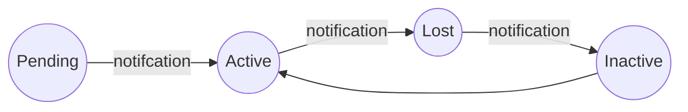

# device-tracker  
  
**Tracker users activity for mobile apps.**  
****
  
With this project what we want to do is notify the users every time we change the internal status of the deferents registered devices.  

**Here is the curren flow;** 


> For know we considere this flow, but if you want to add a new status is very **simple**, check next section.

# Adding new status

To add a new device status is very simple, you only need to implement **DeviceWorkflowManager.java** 
```
public class NewDeviceStatusManagerImpl implements DeviceWorkflowManager {  
  
  @Override  
  public Device manage(Device device, TrackedDevice trackedDevice) {  
		//TODO some logic.
  } 
  
}
```
and then you need to add the new status to the enum called **Status.java**
```

NEW_DEVICE_STATUS("newDeviceStatusManagerImpl");

```
and that all!